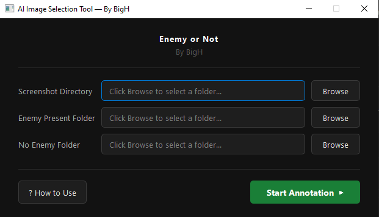

# AI Image Selection Tool
### By BigH

A desktop application for rapidly annotating screenshots into labelled categories for AI training datasets. Built with Python and PyQt5, it provides a clean dark-themed interface to sort images into **Enemy Present** and **No Enemy Present** folders with a single click.

---

## Features

- **Dark UI** — clean, modern dark theme that's easy on the eyes during long annotation sessions
- **Fast annotation** — one click per image, automatically moves it to the correct folder
- **Progress counter** — always shows how many images remain
- **Directory browser** — pick source and destination folders through a GUI, no path typing needed
- **Built-in guide** — step-by-step how-to accessible directly from the main window
- **Image filtering** — only processes actual image files (`.png`, `.jpg`, `.jpeg`, `.bmp`, `.gif`, `.tiff`, `.webp`)

---

## Project Structure

```
Image-Selection-For-AI/
├── main.py          # Entry point — launches the app
├── ui.py            # All PyQt5 windows and widgets
├── logic.py         # File operations (move, list images)
├── requirements.txt
└── screenshots/
    └── image.png    # Tool preview
```

---

## Requirements

- Python 3.8+
- PyQt5
- Pillow

---

## Installation

**1. Clone the repo**
```bash
git clone https://github.com/BigH018/Image-Selection-For-AI.git
cd Image-Selection-For-AI
```

**2. Install dependencies**
```bash
pip install -r requirements.txt
```

**3. Run the app**
```bash
python main.py
```

---

## Usage

1. **Launch** — run `main.py`
2. **Select folders** — choose your screenshot source folder and two destination folders (enemy / no enemy)
3. **Annotate** — for each image click either:
   - `Enemy Present` — image is moved to the enemy folder
   - `No Enemy Present` — image is moved to the no enemy folder
4. **Done** — a completion message appears once all images are processed

---

## Building an Executable

To distribute the tool without requiring Python:

```bash
pip install pyinstaller
pyinstaller --onefile --noconsole main.py
```

The standalone `.exe` will be output to the `dist/` folder.

---

## Screenshot


